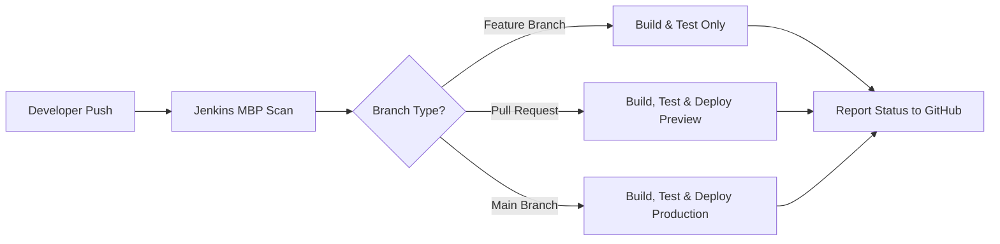

# Task 2: Multi-Branch Pipeline for Microservices Application - Solution

## Table of Contents
- [Overview](#overview)
- [Solution Architecture](#solution-architecture)
- [Implementation Steps](#implementation-steps)
- [Jenkinsfile Design](#jenkinsfile-design)
- [Multi-Branch Pipeline Benefits](#multi-branch-pipeline-benefits)
- [Merge Scenario Walkthrough](#merge-scenario-walkthrough)
- [Interview Questions & Answers](#interview-questions--answers)
- [Production Considerations](#production-considerations)

---

## Overview

This document outlines the solution for building a Jenkins Multi-Branch Pipeline (MBP) for a Flask-based application. The implementation demonstrates how to automate build, test, and deployment workflows using Jenkins MBP with GitHub integration, following trunk-based development practices.

### Task Requirements
- ✅ Set up Multi-Branch Pipeline Job
- ✅ Develop Jenkinsfile for the service
- ✅ Implement automated build, push, deploy, and test stages
- ✅ Simulate feature branch and pull request workflow
- ✅ Document pipeline design and benefits

---

## Solution Architecture

### Project Structure
This project uses a Flask-based application with the following structure:

```
simple-flask-app/
├── app.py              # Flask application
├── Dockerfile          # Container image definition
├── Jenkinsfile         # Pipeline definition
├── requirements.txt    # Python dependencies
└── README.md          # Documentation
```

### Pipeline Flow



---

## Implementation Steps

### Step 1: Set Up Multi-Branch Pipeline Job

#### 1.1 Create MBP in Jenkins
Navigate to Jenkins Dashboard:
```
New Item → Name: "microservices-mbp" → Multibranch Pipeline → OK
```

#### 1.2 Configure Branch Sources
**Branch Source Configuration:**
- **Source**: GitHub
- **Credentials**: Select GitHub PAT or App
- **Repository URL**: `https://github.com/<username>/simple-flask-app.git`
- **Behaviors**:
  - ✅ Discover branches
  - ✅ Discover pull requests from origin
  - ✅ Discover pull requests from forks

#### 1.3 Build Strategies (Production-Recommended)
**Branch Strategy:**
```
"Exclude branches that are also filed as PRs"
```
- Builds branch on every push until PR opens
- Switches to PR job when PR is created
- Prevents duplicate builds

**Pull Request Strategy:**
```
"Both (Merging the pull request with current target branch revision + The current pull request revision)"
```
- Tests PR code as-is (Head)
- Tests PR merged with current `main` (Merge)
- Catches integration issues before merge

**Trust Level:**
```
"From users with Admin or Write permission"
```

#### 1.4 Scan Triggers
- **Periodically if not otherwise run**: ✅ (Interval: 1 hour)
- **Scan by webhook**: ✅ (Preferred for instant triggers)

### Step 2: Develop Jenkinsfile

#### 2.1 Jenkinsfile Implementation

**File**: `Jenkinsfile` (Root level for Flask application)

```groovy
pipeline {
    agent { label "dev" }
    
    environment {
        IMAGE = "docker.io/kenpachikakashi/simple-flask-app"
        TAG = "${env.BUILD_NUMBER}"
    }
    
    stages {
        stage('Build') {
            steps {
                echo "Building service: API"
                sh 'docker build -t "$IMAGE:$TAG" -t "$IMAGE:latest" .'
            }
        }
        
        stage('Push') {
            steps {
                withCredentials([usernamePassword(
                    credentialsId: 'dockerHubCreds',
                    usernameVariable: 'DOCKERHUB_USER',
                    passwordVariable: 'DOCKERHUB_PWD'
                )]) {
                    sh 'echo "$DOCKERHUB_PWD" | docker login -u "$DOCKERHUB_USER" --password-stdin'
                    sh 'docker push "$IMAGE:$TAG"'
                    sh 'docker push "$IMAGE:latest"'
                }
            }
        }
        
        stage('Deploy') {
            steps {
                sh 'docker pull "$IMAGE:$TAG"'
                sh 'docker rm -f flask-app || true'
                sh 'docker run -d --name flask-app -p 5000:5000 "$IMAGE:$TAG"'
                
                sh '''
                    cat > deploy-info-$BUILD_NUMBER.txt <<EOF
build: $BUILD_NUMBER
image: $IMAGE:$TAG
commit: ${GIT_COMMIT}
branch: $GIT_BRANCH
time: $(date -u +"%Y-%m-%dT%H:%M:%SZ")
url: $BUILD_URL
EOF
                '''
                
                archiveArtifacts artifacts: "deploy-info-${BUILD_NUMBER}.txt", fingerprint: true
            }
        }
        
        stage('Test') {
            steps {
                sh 'sleep 2; curl -s http://localhost:5000 || true'
            }
        }
        
        stage('Cleanup') {
            steps {
                echo "Cleaning up workspace..."
                sh 'docker logout || true'
            }
        }
    }
    
    post {
        always {
            echo "Pipeline execution completed for branch: ${env.GIT_BRANCH}"
        }
        success {
            echo "✅ Build successful for build #${env.BUILD_NUMBER}"
        }
        failure {
            echo "❌ Build failed for build #${env.BUILD_NUMBER}"
        }
    }
}
```

#### 2.2 Key Pipeline Features

**Environment Variables:**
- `IMAGE`: Docker registry path for the Flask app
- `TAG`: Dynamic tagging using Jenkins build number

**Pipeline Stages Explained:**

1. **Build**: Creates Docker image with two tags (build number and `latest`)
2. **Push**: Authenticates to Docker Hub and pushes images to registry
3. **Deploy**: Pulls image and runs container on port 5000
4. **Test**: Performs smoke test with curl to verify app is running
5. **Cleanup**: Logs out of Docker registry

**Post-Build Actions:**
- Archives deployment metadata as artifacts
- Logs build status (success/failure)
- Cleans up Docker credentials

---

## Multi-Branch Pipeline Benefits

### How MBP Improves CI/CD Workflow

#### 1. **Automatic Discovery & Isolation**
- Each branch/PR gets its own isolated job
- No manual job creation for new branches
- Automatic cleanup when branches are deleted

**Example**: When a developer creates `feature/ui` and `feature/add-endpoint`, Jenkins automatically:
- Discovers both branches
- Creates separate jobs for each
- Runs independent pipelines
- Reports status to each PR independently

#### 2. **Automated Build Pipeline**
- Every push triggers automatic build/test/deploy
- Consistent environment across all branches
- Reduces manual intervention and human error

**Workflow**:
```
Push to branch → Jenkins builds → Tests run → Deploy to environment → Report status
Total time: ~5 minutes for fast feedback
```

#### 3. **Environment-Specific Deployments**
- Feature branches → Preview environments
- PR branches → Integration testing environments
- Main branch → Production deployment

#### 4. **Quality Gates per Branch**
Each branch type can have:
- Different deployment strategies
- Branch-specific quality thresholds
- Custom test requirements
- Environment-specific configurations

#### 5. **Traceability & Auditability**
- Per-branch build history in Jenkins
- Artifact tracking with deployment metadata files
- Docker image tagging with build numbers
- GitHub integration for commit status checks

**Deployment Metadata Example** (from `deploy-info-<build>.txt`):
```
build: 123
image: docker.io/kenpachikakashi/simple-flask-app:123
commit: abc123def456
branch: feature/ui
time: 2026-01-05T14:30:00Z
url: https://jenkins.example.com/job/flask-mbp/123/
```

#### 6. **Risk Mitigation**
- Test changes in isolation before merging
- Catch integration issues early (Merge strategy)
- Easy rollback using tagged Docker images
- Preview environments for PR validation

---

## Merge Scenario Walkthrough

### Simulated Pull Request Workflow

#### Scenario: Adding New UI Feature to Flask App

**Step 1: Create Feature Branch**
```bash
# Developer starts work on feature
git switch -c feature/add-user-endpoint
```

**Step 2: Make Changes and Commit**
```bash
# Edit app.py to update UI message
vim app.py  # Change UI message to "We've added a new Feature"

git add app.py
git commit -m "feat: update UI message"
git push origin feature/ui
```

**Step 3: Jenkins MBP Discovers Branch**
- Webhook triggers Jenkins scan (or periodic scan runs)
- Jenkins finds `feature/ui`
- Creates child job: `flask-mbp/feature/ui`
- Runs pipeline automatically

**Pipeline Execution (Branch Job)**:
```
✅ Build: Docker image built (simple-flask-app:123)
✅ Push: Image pushed to Docker Hub
✅ Deploy: Container running on port 5000
✅ Test: curl http://localhost:5000 succeeds
📊 Status: Posted to GitHub commit
```

**Step 4: Open Pull Request**
```bash
# On GitHub: Create PR feature/ui → main
```

**Jenkins Actions**:
- Detects PR creation via webhook
- Creates PR job: `flask-mbp/PR-1`
- Stops branch job (due to "Exclude branches..." strategy)
- Runs PR pipeline with both Head and Merge strategies

**PR Pipeline Execution**:
```
✅ Build: Image docker.io/kenpachikakashi/simple-flask-app:124
✅ Push: Image pushed to Docker Hub
✅ Deploy: Container running as flask-app on port 5000
✅ Test: curl http://localhost:5000 succeeds
📊 Archive: deploy-info-124.txt created
📊 Status: "All checks passed" → GitHub PR
```

**Step 5: Code Review**
Team members review:
- Code changes in GitHub PR
- Jenkins build results
- Deployment artifacts
- Test coverage reports

**Step 6: Update PR (New Commits)**
```bash
# Developer addresses review comments
git add .
git commit -m "fix: improve UI message formatting"
git push origin feature/ui
```

Jenkins automatically:
- Detects new commit on PR
- Re-runs PR pipeline
- Updates status on GitHub

**Step 7: Main Branch Updates (Merge Strategy Test)**
Meanwhile, another team member merges a different PR to `main`:
```bash
# Someone else merged a different feature to main
# Main now has updated dependencies in requirements.txt
```

Jenkins automatically:
- Re-runs PR-1's Merge strategy
- Tests PR-1 code merged with latest main
- Catches potential integration issue (dependency conflict)
- Reports status: "Merge build failed" or passes if no conflict

Developer fixes any conflicts:
```bash
git fetch origin
git merge origin/main
# Fix conflicts in requirements.txt if any
git commit -m "merge: resolve conflicts with main"
git push origin feature/ui
```

**Step 8: All Checks Pass → Merge**
```
✅ Head build: Passed
✅ Merge build: Passed
✅ Code review: Approved (1/1)
✅ Up to date: Yes
```

Merge the PR on GitHub (Squash and merge)

**Step 9: Main Pipeline Executes**
```bash
# Merge creates new commit on main
# Jenkins webhook triggers main pipeline
```

**Main Job Execution**:
```
✅ Build: Production image built
✅ Test: All tests pass
✅ Push: Image pushed to docker.io/kenpachikakashi/simple-flask-app:123
✅ Deploy: Production container updated
✅ Integration Test: Smoke tests pass
📊 Archive: deploy-info-123.txt saved
```

**Step 10: Cleanup**
- GitHub auto-deletes `feature/ui` (if enabled)
- Jenkins marks PR-1 job as complete
- Orphan cleanup removes the branch job after configured delay
- Old Docker containers cleaned up (optional)

### Verification
```bash
# Check production deployment
curl http://localhost:5000
# Response: HTML with updated UI message

# Check Docker container
docker ps | grep flask-app
# Shows: flask-app container running on 0.0.0.0:5000

# Check Jenkins artifacts
cat deploy-info-125.txt
# Output:
# build: 125
# image: docker.io/kenpachikakashi/simple-flask-app:125
# commit: abc123def456
# branch: main
# time: 2026-01-05T14:30:00Z
# url: https://jenkins.example.com/job/flask-mbp/job/main/125/
```

---

## Interview Questions & Answers

### Q1: How does a multi-branch pipeline improve continuous integration for microservices?

**Answer:**

Multi-branch pipelines provide several critical improvements for microservices CI:

**1. Automatic Service Discovery & Lifecycle Management**
- Jenkins automatically discovers each service's branches and PRs
- No manual job configuration needed when new services or branches are added
- Automatic cleanup when branches/PRs are deleted, preventing job sprawl
- Scales effortlessly as microservices architecture grows

**2. Isolated Build & Test Environments**
- Each service branch gets its own isolated pipeline execution
- Services can fail independently without blocking others
- Different services can have different Jenkinsfiles (Python vs Node vs Go)
- Service-specific dependencies and tools don't conflict

**3. Parallel Execution for Speed**
- Multiple microservices build/test concurrently using Jenkins parallel stages
- Reduces overall CI/CD pipeline time significantly
- Example: 5 services × 10 min each = 10 min total (vs 50 min sequential)
- Faster feedback loops for developers

**4. Branch-Specific Deployment Strategies**
- Feature branches: Build and unit test only (fast feedback, ~5 min)
- PR branches: Full integration tests with preview environments
- Main branch: Production deployment with approval gates
- Different quality gates per branch type

**5. Integration Testing Before Merge**
- Merge strategy tests code merged with current `main`
- Catches integration issues before they reach production
- Prevents "works on my branch" problems
- Critical for microservices where services depend on each other

**6. Improved Traceability**
- Each service has independent build history
- Easy to track which version of Service A works with Service B
- Artifact metadata shows exact commit, branch, timestamp
- Simplifies debugging and rollbacks

**7. Webhook-Driven Automation**
- Push to branch → automatic build
- Open PR → automatic integration test
- Merge to main → automatic deployment
- Zero manual intervention needed

**Real-World Example from Our Implementation:**
```groovy
// Our Jenkinsfile automatically:
// 1. Builds Docker image for Flask service
// 2. Runs unit tests (if added)
// 3. Pushes to registry only for main/PR branches
// 4. Deploys to appropriate environment (preview vs prod)
// 5. Archives deployment metadata
// All triggered automatically by Git events
```

---

### Q2: What challenges might you face when merging feature branches in a multi-branch pipeline?

**Answer:**

**1. Integration Drift (Solved by Merge Strategy)**

**Challenge:**
- Developer works on `feature/payment-service` for 2 weeks
- Meanwhile, `main` receives 50 commits from other developers
- Developer's code works in isolation but breaks when merged with current `main`

**Solution:**
```groovy
// Configure PR strategy: "Both (Head + Merge)"
// Jenkins automatically:
// 1. Tests PR code as-is (Head)
// 2. Tests PR merged with current main (Merge)
// 3. Re-runs Merge build when main updates
// 4. Fails PR if merged code would break
```

**Real Example:**
```
Day 1: Dev creates feature/api-v2
Day 5: Someone merges breaking change to main (API contract change)
Day 7: Dev opens PR
Jenkins: ✅ Head passes, ❌ Merge fails (API incompatibility detected)
Dev: Fixes code to work with new API
Jenkins: ✅ Head passes, ✅ Merge passes → Safe to merge
```

**2. Resource Contention & Port Conflicts**

**Challenge:**
- Multiple PRs try to deploy to the same Jenkins agent
- Services bind to same ports (e.g., all use port 5000)
- Docker containers collide or tests interfere with each other

**Solution:**
```groovy
environment {
    // Dynamic port allocation based on build number or PR ID
    PORT = "${env.CHANGE_ID ? 5000 + env.CHANGE_ID.toInteger() : 5000}"
}

stage('Deploy Preview') {
    steps {
        sh '''
            # Use unique container name per PR
            CONTAINER_NAME="flask-app-${CHANGE_ID:-main}"
            docker rm -f $CONTAINER_NAME || true
            docker run -d --name $CONTAINER_NAME -p ${PORT}:5000 "$IMAGE:$TAG"
        '''
    }
}
```

**3. Credential & Secret Management**

**Challenge:**
- Feature branches need database access for testing
- Don't want to expose production credentials
- Fork PRs from external contributors need limited access

**Solution:**
```groovy
// Use environment-specific credentials
when { branch 'main' }
withCredentials([string(credentialsId: 'prod-db-password', variable: 'DB_PASS')]) {
    // Production deployment
}

when { not { branch 'main' } }
withCredentials([string(credentialsId: 'test-db-password', variable: 'DB_PASS')]) {
    // Preview deployment
}

// For forks: Use "Trust" policy to restrict credential access
// Configure: "From users with Admin or Write permission"
```

**4. Build Time & Resource Constraints**

**Challenge:**
- 20 developers creating feature branches simultaneously
- Each builds 5 microservices = 100 concurrent builds
- Jenkins agents overwhelmed, builds queue up
- Feedback delayed from 5 minutes to 2 hours

**Solution:**
```groovy
// 1. Throttle concurrent builds
options {
    throttleJobProperty(
        categories: ['microservices'],
        maxConcurrentPerNode: 2,
        maxConcurrentTotal: 10
    )
}

// 2. Cancel outdated builds (newest wins)
options {
    disableConcurrentBuilds()
}

pipeline {
    stages {
        stage('Build') {
            steps {
                milestone(ordinal: 1, label: 'Build')
                // Only latest build proceeds
            }
        }
    }
}

// 3. Build only changed services (monorepo)
when {
    changeset "service-api/**"
}

// 4. Use Docker layer caching
sh 'docker build --cache-from "$IMAGE:latest" -t "$IMAGE:$TAG" .'
```

**5. Dependency Hell in Microservices**

**Challenge:**
- Service A (PR-42) depends on Service B v2.0
- Service B is still on v1.5 in main
- PR can't test full integration without Service B updates

**Solution:**
```groovy
// Option 1: Deploy all services from same PR/branch
stage('Deploy Full Stack') {
    steps {
        sh '''
            # Use docker-compose with environment-specific overrides
            export TAG=${BUILD_NUMBER}
            docker-compose -f docker-compose.yml \
                          -f docker-compose.pr.yml \
                          up -d
        '''
    }
}

// Option 2: Version pinning in docker-compose
services:
  api:
    image: registry/service-a:${TAG:-latest}
  database:
    image: registry/service-b:${SERVICE_B_VERSION:-2.0}
```

**6. Test Data Isolation**

**Challenge:**
- PR-41 and PR-42 both use same test database
- Tests interfere with each other
- Flaky tests due to concurrent data modifications

**Solution:**
```groovy
// Create isolated database per PR
stage('Setup Test Environment') {
    steps {
        sh '''
            # Create unique database
            DB_NAME="test_db_pr_${CHANGE_ID}"
            docker run -d --name db-${CHANGE_ID} \
                -e POSTGRES_DB=$DB_NAME \
                postgres:13
                
            # Run migrations
            export DATABASE_URL=postgresql://localhost:5432/$DB_NAME
            python manage.py migrate
        '''
    }
}

post {
    always {
        sh 'docker rm -f db-${CHANGE_ID} || true'
    }
}
```

**7. Stale Branches & Orphaned Jobs**

**Challenge:**
- Developer creates 10 feature branches
- Abandons 5 without closing PRs
- Jenkins has 100s of stale jobs consuming resources

**Solution:**
```groovy
// Configure Orphaned Item Strategy in MBP:
// Days to keep: 7
// Max # to keep: 10

// In Jenkinsfile:
options {
    // Auto-discard old builds
    buildDiscarder(logRotator(
        numToKeepStr: '10',
        daysToKeepStr: '30'
    ))
}

// Automate branch cleanup
post {
    success {
        script {
            if (env.CHANGE_ID && env.CHANGE_MERGED == 'true') {
                echo "PR merged, branch will be auto-deleted"
            }
        }
    }
}
```

**8. Merge Conflicts**

**Challenge:**
- Two PRs modify same file
- First PR merges successfully
- Second PR now has conflicts but Jenkins can't build Merge strategy

**Solution:**
```
1. Jenkins detects merge conflict
2. Posts status to PR: ❌ "Merge conflict detected"
3. Developer:
   git fetch origin
   git merge origin/main
   # Resolve conflicts
   git push
4. Jenkins re-runs Merge strategy
5. Status updates: ✅ "Conflicts resolved, build passed"
```

**9. Docker Image Tagging & Promotion**

**Challenge:**
- PR builds image `service:pr-42`
- PR merges to main
- Main rebuilds same code as `service:123`
- Different image digests for same code = audit nightmare

**Solution:**
```groovy
// Build once in PR, promote in main
stage('Promote Image') {
    when { 
        branch 'main'
        environment name: 'CHANGE_TARGET', value: 'main'
    }
    steps {
        script {
            // Tag PR image for production
            def prImage = "service:pr-${env.CHANGE_ID}"
            def prodImage = "service:${BUILD_NUMBER}"
            sh """
                docker pull $prImage
                docker tag $prImage $prodImage
                docker push $prodImage
            """
        }
    }
}

// Archive image digest for traceability
sh 'docker inspect "$IMAGE:$TAG" | jq -r ".[0].RepoDigests[0]" > image-digest.txt'
archiveArtifacts 'image-digest.txt'
```

**10. Race Conditions in Parallel Stages**

**Challenge:**
```groovy
parallel {
    stage('Service A') { sh 'docker-compose up db' }
    stage('Service B') { sh 'docker-compose up db' }
}
// Both try to create same database container
```

**Solution:**
```groovy
stage('Setup Shared Resources') {
    steps {
        sh 'docker-compose up -d db redis'
    }
}

stage('Build Services in Parallel') {
    parallel {
        stage('Service A') { sh 'docker build service-a' }
        stage('Service B') { sh 'docker build service-b' }
    }
}
```

---

## Production Considerations

### Best Practices for Flask MBP

#### 1. Repository Structure
**Our Implementation**: Single repository with application code and Jenkinsfile
```
simple-flask-app/
├── app.py
├── Dockerfile
├── Jenkinsfile
├── requirements.txt
└── README.md
```

**Advantages**:
- Simple structure, easy to understand
- Single MBP job manages all branches
- Jenkinsfile versioned with code
- Works well for single-service applications

#### 2. Webhook Configuration
```
GitHub Repo → Settings → Webhooks → Add webhook
URL: https://jenkins.example.com/github-webhook/
Events: 
  ✅ Pushes
  ✅ Pull requests
  ✅ Branch or tag creation
  ✅ Branch or tag deletion
```

#### 3. Branch Protection Rules
```
Branch: main
Rules:
  ✅ Require pull request before merging
  ✅ Require status checks to pass:
     - continuous-integration/jenkins/branch
     - continuous-integration/jenkins/pr-merge
  ✅ Require branches to be up to date
  ✅ Require approvals: 1
  ✅ Dismiss stale reviews
  ❌ Allow force pushes (never!)
```

#### 4. Monitoring & Alerting
```groovy
post {
    failure {
        // Notify team on Slack/email
        slackSend(
            channel: '#deployments',
            color: 'danger',
            message: "Build Failed: ${env.JOB_NAME} #${env.BUILD_NUMBER}"
        )
    }
}
```

#### 5. Security Hardening
- Use Jenkins credentials manager (never hardcode secrets)
- Restrict fork PR permissions (Trust policy)
- Scan Docker images for vulnerabilities
- Sign container images for supply chain security

---

## Conclusion

This solution demonstrates a production-ready Multi-Branch Pipeline for a Flask application using:
- ✅ Automatic branch/PR discovery
- ✅ Automated build, push, deploy, and test stages
- ✅ Docker containerization for consistent deployments
- ✅ GitHub integration for status checks and branch protection
- ✅ Comprehensive artifact tracking and traceability
- ✅ Automated merge workflows with conflict detection

The implementation leverages Jenkins MBP's strengths to create an automated CI/CD workflow while addressing common challenges like integration drift, credential management, and deployment tracking.

**Key Takeaway**: Multi-branch pipelines transform CI/CD from manual, error-prone processes into automated, scalable workflows that support trunk-based development and continuous delivery.

---

## References

- [Jenkins Multibranch Pipeline Documentation](https://www.jenkins.io/doc/book/pipeline/multibranch/)
- [GitHub Branch Source Plugin](https://plugins.jenkins.io/github-branch-source/)
- [Pipeline Syntax Reference](https://www.jenkins.io/doc/book/pipeline/syntax/)
- [Docker Best Practices](https://docs.docker.com/develop/dev-best-practices/)
- [Microservices Architecture Patterns](https://microservices.io/patterns/)
- [CloudWithVarJosh Jenkins Tutorial - Day 07](https://github.com/CloudWithVarJosh/Jenkins-Basics-To-Production/blob/main/Day%2007/README.md)
- Project README: `README.md` (this repository)
